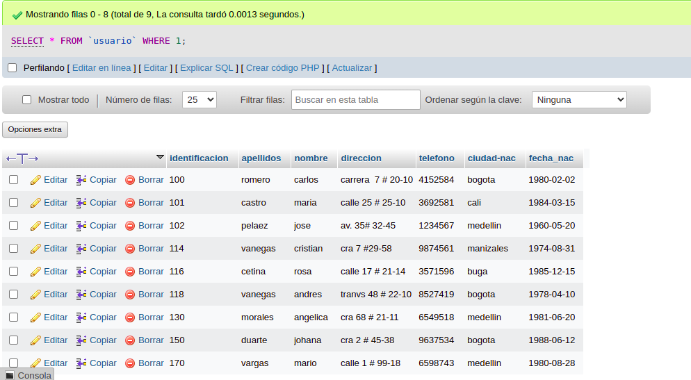
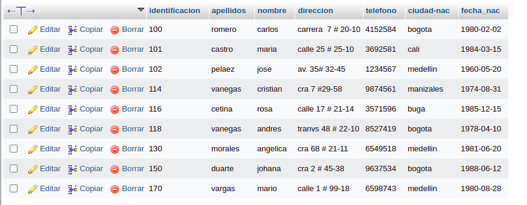
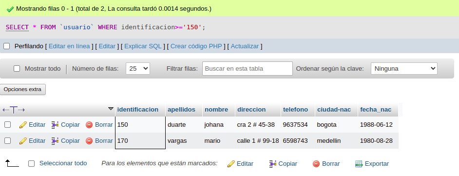

# consultas_1.sql

#CONSULTAS SQL

1. Para visualizar toda la informacion que contiene la tabla `usuario` se puede incluir con la instruccion SELECT el caracter '*' o cada uno de lo campos de la tabla

SELECT * FROM `usuario` 

2. visualizar solamente la identificacion del usuario.

SELECT identificacion FROM `usuario`

3. se desea obtener los registros cuya identificacion sean mayoes o iguales a 150, se debe utilizar la claudala WHERE que especifica las condiciones que deben reunir los registro que se debe reunir los registros que se van a seleccionar.

SELECT * FROM `usuario` WHERE identificacion>='150'

